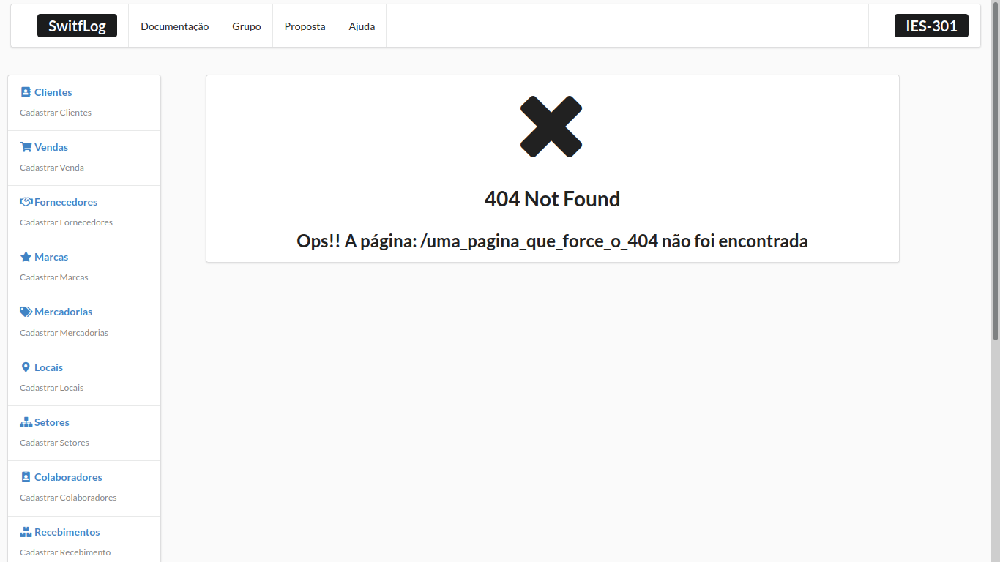
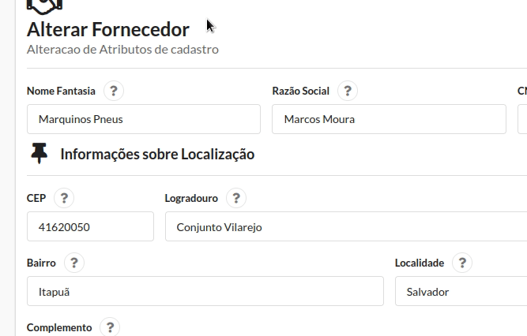

<h1>Gerenciador de Estoque</h1>

Repositório dedicado ao Frontend em <b>desenvolvimento</b> da aplicação
<a href="https://github.com/watanabe9090/gerenciador_estoque_spring"> 
gerenciado_estoque_spring
</a>
onde é feito um software que abrange as funcionalidades básicas de um gerenciador de estoque

### Table da Conteúdos

* Introdução
* Features
* Desmonstração da Aplicação
* Como instalar
* Tecnologias
* APIs utilizadas

### Introdução

  O projeto ainda está incompleto, faltando algumas funcionalidades e telas. Ele está sendo desenvolvido para a 
  matéria de laboratório de engenharia de software, onde está sendo desenvolvido um software de gerência de estoque

### Features
<ul>
    <li>[X] Entrada de produtos</li>
    <li>[ ]  Saída de produtos</li>
    <li>[X] Cadastro / Alteração / Detalhamento de Locais</li>
    <li>[X] Cadastro / Alteração / Detalhamento de Setores</li>
    <li>[X] Cadastro / Alteração / Detalhamento de Fornecedores</li>
    <li>[X] Cadastro / Alteração / Detalhamento de Marcas</li>
    <li>[X] Cadastro / Alteração / Detalhamento de Clientes</li>
    <li>[X] Cadastro / Alteração / Detalhamento de Colaboradores</li>
    <li>[ ] Cadastro / Alteração / Detalhamento de Lote</li>
    <li>[ ] Buscas </li>  
    <li>[ ] Paginação</li>  
    <li>[ ] Relatórios</li>  
</ul>

### Demonstraação da aplicação
Tela de 404 Not Found
<h1 align="center">
  
</h1>

<h3>Mecanismos de ajuda </h3>

### Instalação

<ol>
    <li>É necessário ter o <a href="https://nodejs.org/en/">node </a>instalado</li>
    <li>Após isso, para instalar as dependências, utilize o comando
    <code>npm install</code>
    </li>
    <li>Com isso, a aplicação iniciará no navegador padrão na porta 3000
    </li>
    <li>
    O Programa funciona como <i>frontend</i> do repositório 
    <a href="https://github.com/watanabe9090/gerenciado_estoque_spring">gerenciador_estoque_spring</a>
    </li>
</ol>

### Tecnologias Utilizadas
<ul>
    <li><a href="https://reactjs.org/">Biblioteca React</a></li>
    <li><a href="https://react.semantic-ui.com/">Framework Semantic UI React</a></li>
    <li><a href="https://developer.mozilla.org/pt-BR/docs/Web/JavaScript">Javascript</a></li>
</ul>

### APIs utilizadas
Para realizar a busca de CEPs foi utilizado o <i>webservice</i>
<a href="https://viacep.com.br/">ViaCEP</a>
